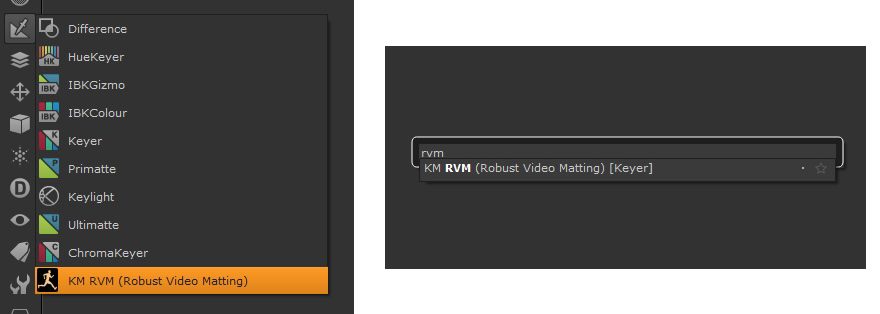
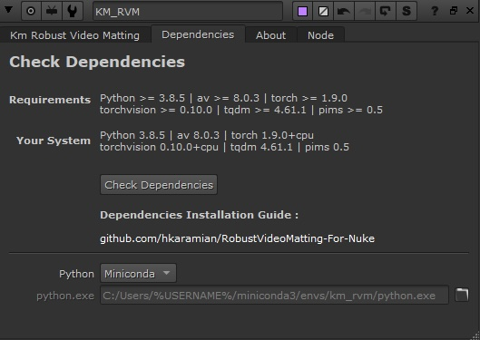
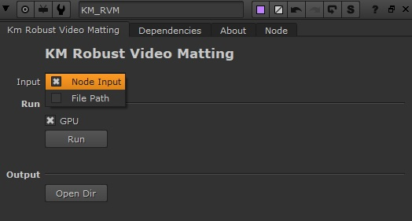

## Km_RobustVideoMatting
<a href="https://github.com/PeterL1n/RobustVideoMatting" target="_blank">RobustVideoMatting</a> Plugin for Foundry Nuke

Robust Video Matting(RVM) is specifically designed for robust human video matting. Unlike existing neural models that process frames as independent images, RVM uses a recurrent neural network to process videos with temporal memory. RVM can perform matting in real-time on any videos without additional inputs. It achieves **4K 76FPS** and **HD 104FPS** on an Nvidia GTX 1080 Ti GPU.


<br>

## Showreel
Watch the showreel video ([YouTube](https://youtu.be/Jvzltozpbpk))  to see the model's performance. 

<p align="center">
    <a href="https://youtu.be/Jvzltozpbpk">
        
    </a>
</p>

All footage in the video are available in [Google Drive](https://drive.google.com/drive/folders/1VFnWwuu-YXDKG-N6vcjK_nL7YZMFapMU?usp=sharing).

<br>


## Installation

<center>
<a href="https://vimeo.com/664873484" target="_blank">Installation Video Guide Here</a>
</center>

### Add RVM to Nuke
1. Copy 'KM_RVM_Nuke' folder to nuke plugin path (.nuke folder)
2. Add following line to init.py file in the nuke plugin path :
```python
nuke.pluginAddPath('./KM_RVM_Nuke')
```
<br>
Restart nuke, now you can find RVM node via Nodes menu under "Keying" or simply search "rvm" in nodes search bar :
<p align="center">

 </p>


### Install Dependencies
#### Method 1 (recommended) :
1. Download and Install MiniConda : 
https://repo.anaconda.com/miniconda/Miniconda3-latest-Windows-x86_64.exe

2. Open "Anaconda Prompt" located in "KM_RVM_Nuke" folder, or find it in windows search.
Run bellow commands, line by line
```sh
conda create -n km_rvm python=3.9.0
conda activate km_rvm
pip install -r C:\Users\%USERNAME%\.nuke\KM_RVM_Nuke\requirements.txt
pip install "av==8.0.3" "tqdm==4.61.1" "pims==0.5"
pip install torch torchvision
```
Replace last line with this if you want to add gpu supoort (it needs download more dependencies and huge files): 
```python
pip install torch torchvision --index-url https://download.pytorch.org/whl/cu118
```
, change "cu118" to your graphic card Cuda version. Cuda table is provided bellow, end of this page.  

All set up, You ready to go ! 


#### Method 2  :
If you have your own python installed and you are familiar with installing packages,  install dependencies using "requirements_inference_Km.txt" file.
Then in dependencies tab of the gizmo, set python path to you custom python. 

### Check Dependencies
In Dependencies tab, click on "Check Dependencies" button to show your system configs. Compare it to the requirements.  
<p align="center">
 
 </p>


### Compatibility
OS : Window

Nuke Version: 15.x, 14.x, 13.x, 12.x 


## Usage

<p align="center">
Simply connect your input or choose file path ! 




## Graphic Cards CUDA Version
Use this table to find out which version of pytorch cuda you need 

| Graphic Card | Compute Capability | Compatible CUDA Toolkit Version | Command
|---|---|---|---|
| NVIDIA GeForce RTX 4090 | 9.0 | 11.8 | cu118 |
| NVIDIA GeForce RTX 3080 | 7.5 | 11.8 | cu118 |
| NVIDIA GeForce RTX 3070 | 7.5 | 11.8 | cu118 |
| NVIDIA GeForce RTX 3060 | 7.5 | 11.8 | cu118 |
| NVIDIA GeForce RTX 2080 | 7.2 | 11.6 | cu116 |
| NVIDIA GeForce RTX 2070 | 7.2 | 11.6 | cu116 |
| NVIDIA GeForce GTX 1660 | 6.1 | 11.4 | cu114 |
| NVIDIA GeForce GTX 1080 | 6.1 | 11.2 | cu112 |
| NVIDIA GeForce 840M | 5.0 | 10.2 | cu102 |
 


